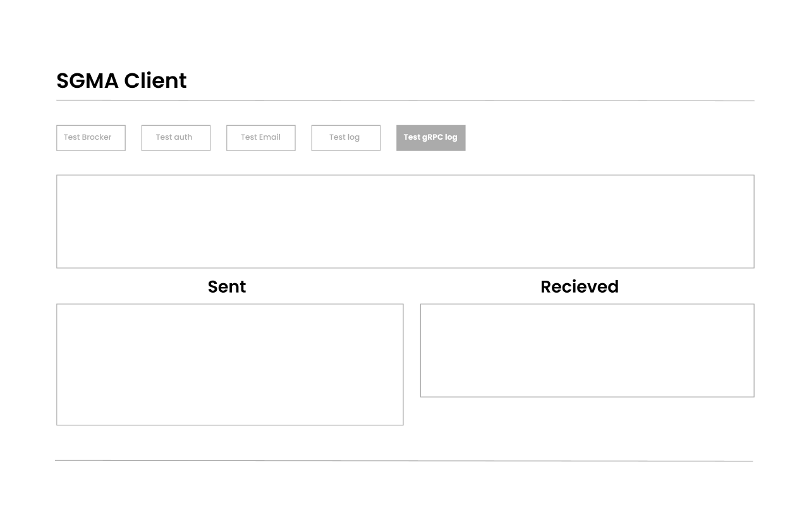

## What I'm building here : 
A front end web app that connects to 5 microservices :

* [ ] Brocker : Optional single point of entry to microservices, nothing just recieving requests from front, firing off requests & consumer responses ! 
* [ ] Authentication :   Postgress
* [ ] Logger : MongoDB
* [ ] Mail : send email with a specific template 
* [ ] Listneer  : consumes messages in in RabbitMQ & initiates a process

## Communication :

* [ ] I will start by Connecting those microservices using Rest API with JSON as transport 
* [ ] Then, Play with RPC, gRPC and testing performences 
* [ ] instantiate and responding to events using AMQP  

## Wirframe : 

